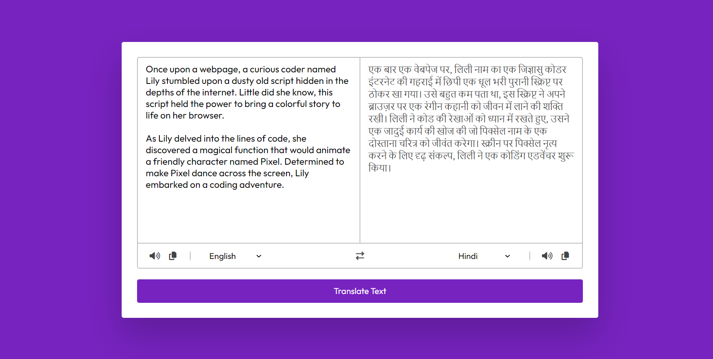

# Language Translator

Welcome to the Language Translator repository! This project is a JavaScript-based web application designed to translate text into multiple languages. Built with HTML, CSS, and JavaScript, it features a modern UI design for an intuitive and user-friendly experience. The translator supports copy functionality and provides voiceover for the translated text.

## Preview



## Features

- **Multilingual Translation:** Translate text into multiple languages.
- **Copy Functionality:** Easily copy the translated text to the clipboard.
- **Voiceover:** Listen to the pronunciation of the translated text.
- **Modern UI Design:** Sleek layout and visually appealing design for an immersive translation experience.

## Getting Started

To run the Language Translator locally, follow these steps:

1. Clone the repository to your local machine:

   ```bash
   git clone https://github.com/Devsethi3/Language-Translator.git
   ```

2. Open the `index.html` file in your preferred web browser.

## Usage

1. Enter the text you want to translate into the input area.
2. Select the target language from the dropdown menu.
3. Click the "Translate" button to see the translated text.
4. Use the "Copy" button to copy the translated text to the clipboard.
5. Click the speaker icon to listen to the pronunciation.

## Customization

Feel free to customize this project to fit your preferences. Update styles, colors, and layout in the HTML and CSS files. You can also extend the functionality to include additional features or support more languages.

## Contributing

If you'd like to contribute to this project, please follow these steps:

1. Fork the repository.
2. Create a new branch for your feature or improvement.
3. Make your changes and commit them with descriptive messages.
4. Push your changes to your forked repository.
5. Open a pull request to merge your changes into the main branch.

Explore the Language Translator, break down language barriers, and consider contributing to its development. Thank you for checking out the repository!